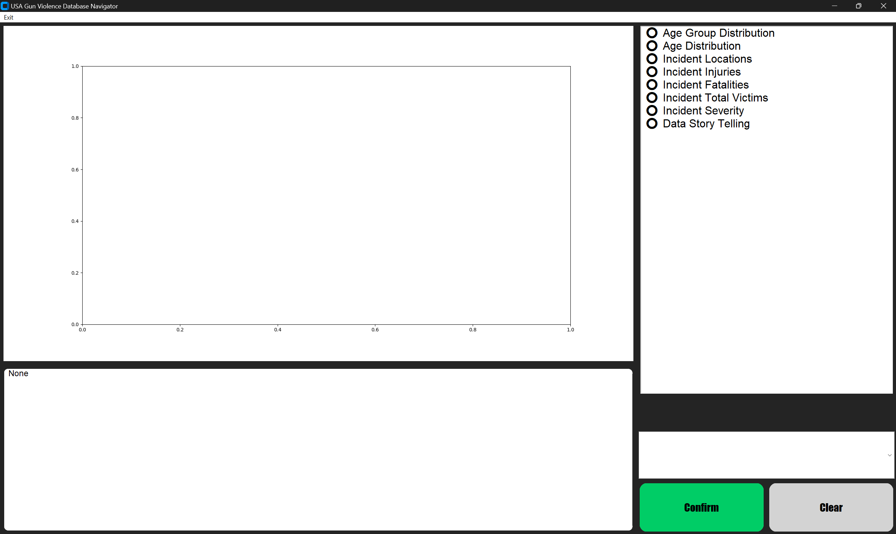
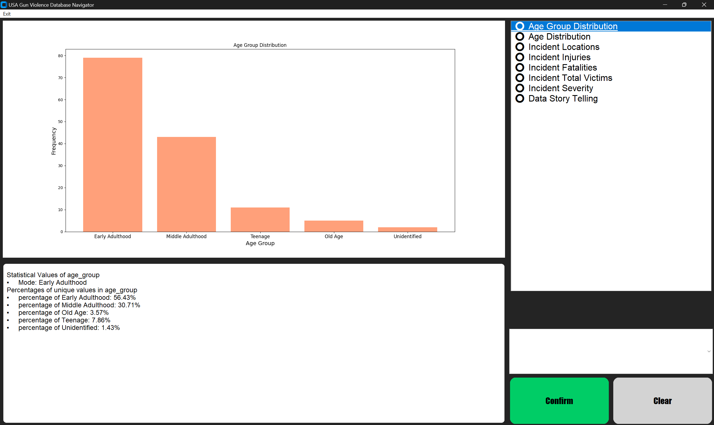
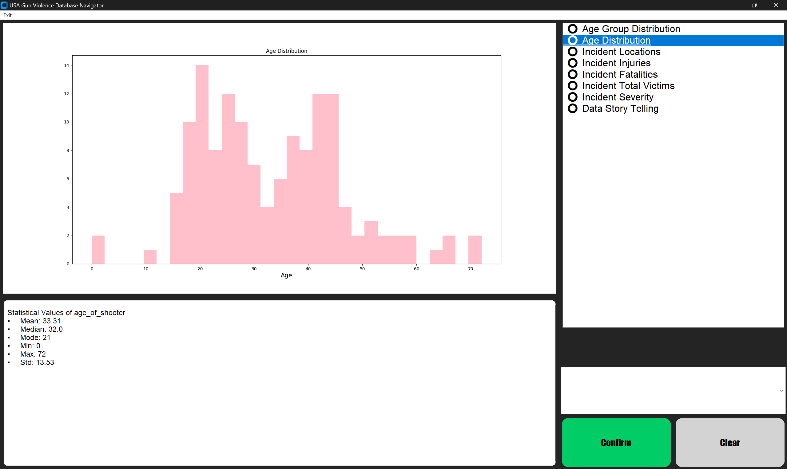
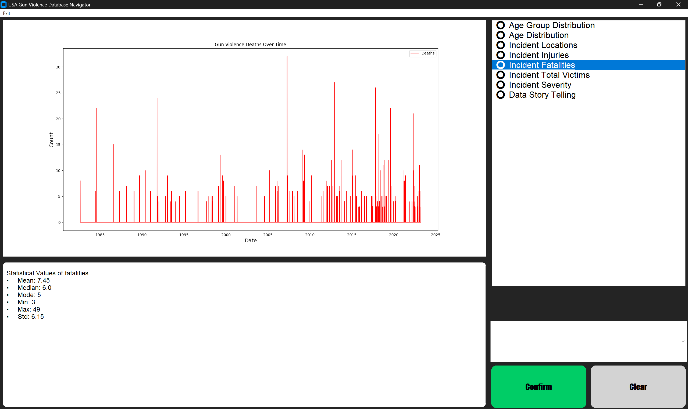
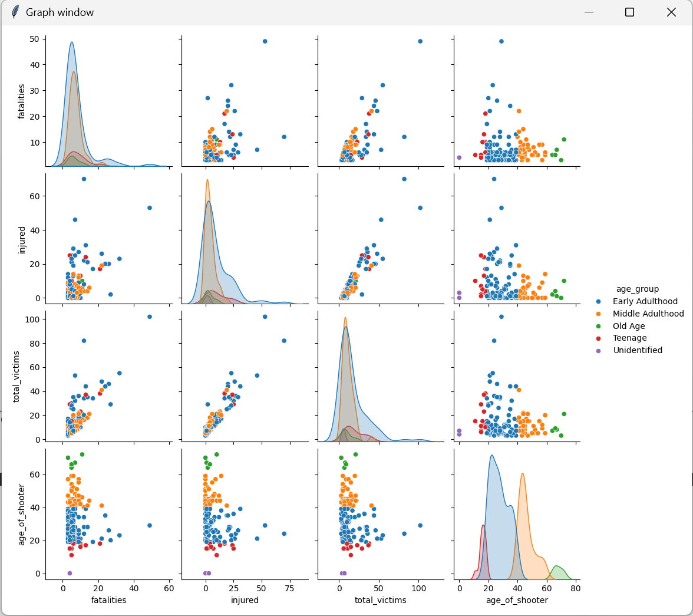
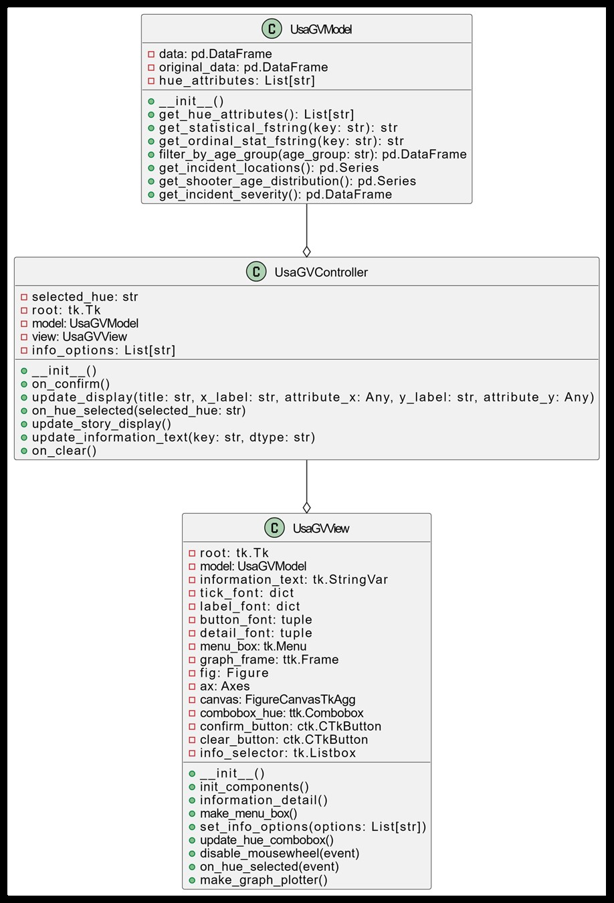
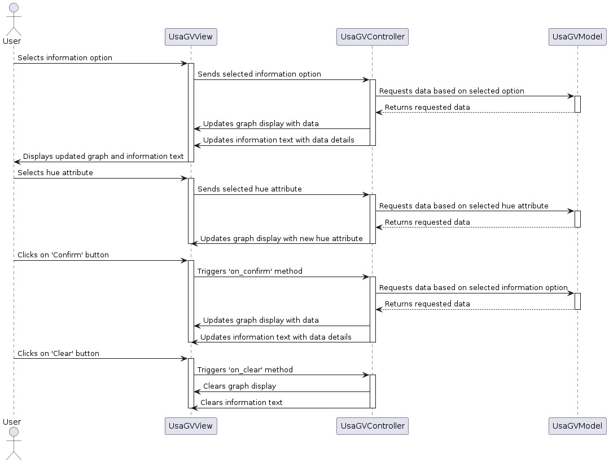

# Year 1 Final Project: USA-gun-violence for Computer Programming 2

## Description
This project is a Database Navigator for the USA Gun Violence Record. 
This program will use tkinter on python as the main programming language for 
the entire project. This project will allow the user to see the relationship of 
the collected data in the events, where they mostly happened, at what age the 
shooters usually are, etc. This program will have an interactive UI design for 
the user to be able to see the relationship between data. The UI will also have 
some graphs such as scatter graph, bar, graph, pie graph, histogram, etc. about 
interesting information that I found to be useful to the user interested in this topic. 
This program will be used to see at what age most of the criminals are. 
Exploring the Relationship Between Shooter Age and Incident Severity. Investigate 
how the age of the shooter influences the severity of gun violence in the USA.

## How to run
Packages needed to run this program properly are in the requirements.txt file. 
You can start by running the command in your command line or press `pip install -r requirements.txt`,
then you can start the program in `USAgun_app.py`

## Main Features
Main page of the program:
1. Display of the chosen information:
   * Shows the graph(s) of the chosen information that the user selected
2. Information type selector:
   * Select information about the topic you are interested in viewing. The selector can be scrolled to the view with more information.
3. Information about the chosen information
   * Shows information about the selected graph attribute
4. Attribute combobox:
   * Selectable hue the pair plot graph
5. Confirm button:
   * Refresh the Display(1.) and Information about the selected statistics(3.) to the selected information.
6. Clear button:
   * Clears information on display and selected statistics

## File Description
1. USAgun_app.py:
   * Main file to run the program
2. USAgun_model.py:
   * Contains the model class
3. USAgun_view.py:
   * Contains the view class
4. USAgun_controller.py:
   * Contains the controller class
5. shooting_data.csv:
   * Data file used in this project
6. README.md:
   * CURRENT FILE
7. requirements.txt:
   * required packages to run the program
8. LICENSE.txt:
   * Licensing for the project

## Example UI

| Tab                     | Example |
|-------------------------|--|
| Main Page Idle          |  |
| Main Page with example1 |  |
| Main Page with example2 |  |
| Main Page with example3 |  |
| Data Story              |  |

## Class Diagrams
### UML Diagram:

### Sequence Diagram:

## Data Reference
The Dataset used for this project is obtained from kaggle from this link 
[Gun Violence, USA](https://www.kaggle.com/datasets/eimadevyni/shooting-1982-2023-cleaned)
. This file contains record of some of the shooting incidents happened in the USA.

